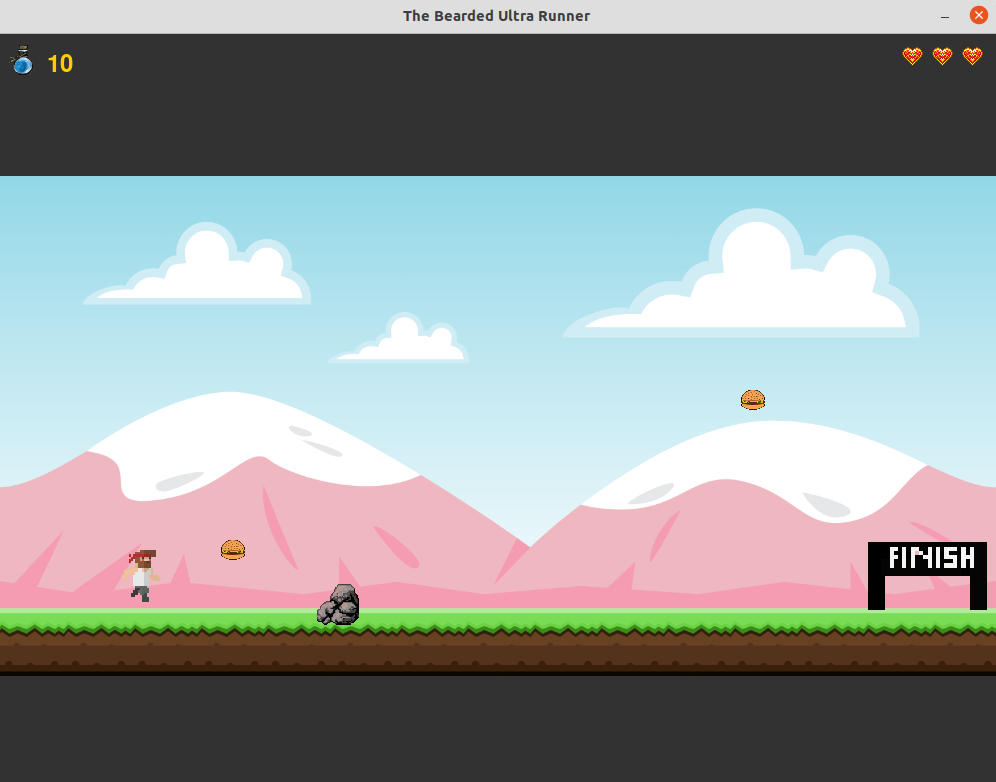

# The Bearded Ultra Runner

A 2D platformer game built with Pygame where you play as an ultra runner navigating through challenging terrain. Collect burgers to maintain your energy, avoid treacherous rock piles, and reach the finish line!



## 🎮 Game Description

The Bearded Ultra Runner is an endurance-based platformer that captures the spirit of ultra running. You'll need to manage your energy levels while navigating through multiple screens, collecting burgers to stay fueled, and avoiding obstacles that could cost you a life. The game features smooth animations, responsive controls, and a challenging progression system.

## ✨ Features

- **Smooth Character Movement**: Responsive controls with running, jumping, and directional movement
- **Energy Management System**: Monitor your energy levels - running consumes energy, and burgers restore it
- **Life System**: You have 3 lives to complete the challenge
- **Multiple Screens**: Navigate through multiple screens before reaching the finish line
- **Animated Sprites**: Character animations for idle, running, and jumping states
- **Collectibles**: Gather burgers scattered throughout the level to maintain your energy
- **Obstacles**: Avoid rock piles that will reset your progress
- **Win/Lose Conditions**: Complete the race by collecting all burgers and reaching the finish line with energy remaining

## 🎯 How to Play

### Controls
- **Arrow Keys (Left/Right)**: Move the runner horizontally
- **Arrow Keys (Up/Down)**: Adjust vertical position (climbing/descending)
- **Spacebar**: Jump

### Objectives
1. Collect at least 2 burgers to maintain your energy
2. Navigate through 2 screens
3. Reach the finish line (x ≥ 880) on the final screen
4. Complete the race with energy remaining

### Game Mechanics
- **Energy System**: Moving consumes energy over time
- **Burgers**: Collect burgers to restore +2 energy
- **Lives**: You start with 3 lives - hitting obstacles or running out of energy costs a life
- **Screen Progression**: When you reach the right edge, you advance to the next screen

## 🚀 Installation & Setup

### Prerequisites
- Python 3.8 or higher
- pip (Python package manager)

### Installation Steps

1. **Clone or download this repository**

2. **Install dependencies**:
   ```bash
   pip install -r requirements.txt
   ```

3. **Ensure asset directories exist**:
   - `images/` - Contains all sprite and background images
   - `sounds/` - Contains game music and sound effects

## 🎮 Running the Game

Simply run the main entry point:

```bash
python platformer.py
```

The game will launch in fullscreen mode. Press the window close button or use your system's quit shortcut to exit.

## 📁 Project Structure

The project follows a modular architecture for better maintainability:

```
Ultrarunning-platformer/
├── platformer.py      # Main entry point
├── game.py            # Game class and main loop
├── player.py          # Player class (movement, rendering)
├── constants.py       # Game constants and configuration
├── resources.py       # Resource loading utilities
├── engine.py          # Animation and entity systems
├── images/            # Game sprites and backgrounds
├── sounds/            # Music and sound effects
└── requirements.txt  # Python dependencies
```

### Architecture Overview

- **`constants.py`**: Centralized configuration values (speeds, sizes, game rules)
- **`resources.py`**: Safe resource loading with error handling
- **`player.py`**: Encapsulates all player-related logic and state
- **`game.py`**: Manages game state, rendering, and the main game loop
- **`platformer.py`**: Simple entry point that initializes and runs the game

## 🛠️ Development

The codebase is organized using object-oriented principles:
- **Separation of Concerns**: Each module has a single, well-defined responsibility
- **Error Handling**: Robust resource loading with fallbacks
- **Maintainability**: Easy to modify game parameters and add new features
- **Extensibility**: Clean structure for adding enemies, power-ups, or new levels

## 📝 Credits

### Assets
- Most game assets are from [OpenGameArt.org](https://opengameart.org)
- Finish line sprite created with [Piskel](https://www.piskelapp.com/p/create/sprite)
- Image editing and resizing done with GIMP

### Technology
- Built with [Pygame](https://www.pygame.org/) - A cross-platform set of Python modules for game development

## 📄 License

See [LICENSE](LICENSE) file for details.
